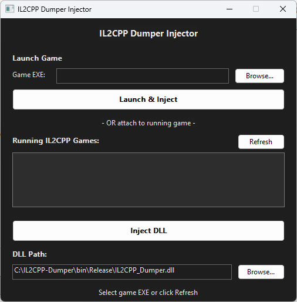

# IL2CPP Dumper

A GUI tool for extracting metadata from Unity IL2CPP games.



## Features

- **GUI Interface** - Simple button-click dumping
- **Built-in Injector** - Manual Map injection (no external tools needed)
- **Architecture-aware Injection** - Auto-detects x86/x64 target and picks matching dumper DLL
- **3 Output Modes**
  - Human: Complete C# code
  - AI: Filtered JSON for LLM analysis
  - Custom: Choose your combination
- **Real-time Progress** - Progress bar and log display
- **Smart Filtering** - Auto-exclude Unity/System assemblies

## Build

### Requirements

- Windows 10/11 (x64)
- Visual Studio 2022 (v143 toolset)

### Build Steps

```cmd
# Open in Visual Studio
start Dump.sln

# Or command line build
msbuild Dump.sln /p:Configuration=Release /p:Platform=x64
```

### Output

```
bin\x64\Release\IL2CPP_Dumper.dll        (x64 Dumper DLL)
bin\Win32\Release\IL2CPP_Dumper.dll      (x86 Dumper DLL)
bin\x64\Release\IL2CPP_Injector.exe      (x64 Injector UI)
bin\Win32\Release\IL2CPP_Injector.exe    (x86 Injector Helper)
```

## Usage

### Step 1: Run Injector

Run `IL2CPP_Injector.exe` as **Administrator**.

> If not running as admin, a prompt will appear.

### Step 2: Select Game or Process

**Option A: Launch Game**
1. Click **Browse...** next to "Game EXE"
2. Select the game executable
3. Click **Launch & Inject** - game starts and DLL is auto-injected

**Option B: Attach to Running Game**
1. Launch the game manually
2. Click **Refresh** to find running Unity processes
3. Select process from list
4. Click **Inject DLL**

### Step 3: Use Dumper GUI

When injection succeeds, a GUI window appears in-game:

- Select output mode (Human/AI/Custom)
- Configure filters
- Click **Start Export**

### Step 4: Check Results

**Human Mode:**
```
C:\IL2CPP_Dump\
  └── *.cs (all assemblies)
```

**AI Mode:**
```
C:\IL2CPP_Dump_JSON\
  └── *.json (filtered full metadata)

C:\IL2CPP_Dump_Summary\
  └── *.json (public API only)
```

## Output Mode Comparison

| Mode | Output | Filtering | Use Case |
|------|--------|-----------|----------|
| Human | C# | None | Code reversing, analysis |
| AI | JSON Full + Summary | Unity/System excluded | LLM analysis |
| Custom | Selectable | Selectable | Custom setup |

## Filter Options

| Option | Description | Default |
|--------|-------------|---------|
| Skip UnityEngine.* | Exclude Unity engine assemblies | ON |
| Skip System.* | Exclude .NET base assemblies | ON |
| Skip private members | Exclude private/internal members | ON |
| Skip compiler-generated | Exclude `<>`, `__` auto-generated code | ON |

## JSON Output Example

### JSON Full

```json
{
  "assembly": "Assembly-CSharp.dll",
  "classes": [
    {
      "name": "PlayerController",
      "fullName": "Game.PlayerController",
      "type": "class",
      "token": "0x2000015",
      "extends": "MonoBehaviour",
      "fields": [
        {"name": "health", "type": "float", "access": "public", "offset": "0x18"}
      ],
      "methods": [
        {"name": "TakeDamage", "returns": "void", "params": [{"type": "float", "name": "amount"}], "access": "public"}
      ]
    }
  ]
}
```

### JSON Summary (for LLM)

```json
{
  "assembly": "Assembly-CSharp.dll",
  "classes": [
    {
      "name": "PlayerController",
      "fullName": "Game.PlayerController",
      "type": "class",
      "extends": "MonoBehaviour",
      "fields": [{"name": "health", "type": "float"}],
      "methods": [{"name": "TakeDamage", "returns": "void", "params": [{"type": "float", "name": "amount"}]}]
    }
  ]
}
```

## Troubleshooting

### "Run as Administrator" prompt appears

- Right-click `IL2CPP_Injector.exe` → Run as administrator
- Or check "Run as administrator" in file properties

### Game not showing in list

- Make sure game is fully loaded before clicking Refresh
- The injector targets Unity runtime processes (IL2CPP/Mono)

### GUI doesn't appear after injection

- Try running injector as administrator
- Temporarily disable antivirus
- Try "Launch & Inject" method instead

### "No assemblies found"

- Wait for game to fully load before injecting
- Retry after runtime and assemblies are fully initialized

### Build fails

- Install Visual Studio 2022
- Install "Desktop development with C++" workload

## License

MIT License
