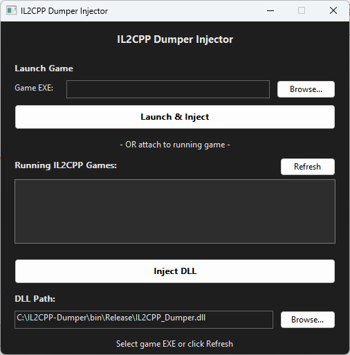

# IL2CPP Dumper

A GUI tool for extracting metadata from Unity IL2CPP games.



## Features

- **GUI Interface** - Simple button-click dumping
- **Built-in Injector** - Manual Map injection (no external tools needed)
- **Architecture-aware Injection** - Auto-detects x86/x64 target and picks matching dumper DLL
- **3 Output Modes**
  - Human: Complete C# code
  - AI: Filtered JSON for LLM analysis
  - Custom: Choose your combination
- **LLM-friendly JSON** - `index.json` + one class per line + split files, with method RVAs, enum values, properties and interfaces (see [docs/SCHEMA.md](docs/SCHEMA.md))
- **Headless mode** - `auto=ai` in `IL2CPP_Dumper.cfg` dumps without a GUI, for scripts and AI agents
- **Real-time Progress** - Progress bar and log display
- **Smart Filtering** - Auto-exclude Unity/System assemblies

## Quick Start (Recommended)

1. Download the latest release zip (`IL2CPP-Universal-*.zip`).
2. Extract all files into one folder.
3. Run `IL2CPP_Injector.exe` as Administrator.
4. Select target process and inject.

> Keep all files in the same folder (`IL2CPP_Injector.exe`, `IL2CPP_Injector_x86.exe`, `IL2CPP_Injector_x64.exe`, `IL2CPP_Dumper_x86.dll`, `IL2CPP_Dumper_x64.dll`).

## Build

### Requirements

- Windows 10/11 (x64)
- Visual Studio 2022 (v143 toolset)

### Build Steps

```cmd
# Open in Visual Studio
start Dump.sln

# Or command line build (both architectures)
msbuild Dump.sln /p:Configuration=Release /p:Platform=x86
msbuild Dump.sln /p:Configuration=Release /p:Platform=x64
```

### Output

```
bin\x64\Release\IL2CPP_Dumper.dll        (x64 Dumper DLL)
bin\Win32\Release\IL2CPP_Dumper.dll      (x86 Dumper DLL)
bin\x64\Release\IL2CPP_Injector.exe      (x64 Injector UI)
bin\Win32\Release\IL2CPP_Injector.exe    (x86 Injector Helper)
```

## Usage

### Step 1: Run Injector

Run `IL2CPP_Injector.exe` (x64 UI) as **Administrator**.

> If not running as admin, a prompt will appear.
> Keep x86/x64 helper files and dumper DLLs in the same folder.

### Step 2: Select Target EXE or Process

**Option A: Launch Game**
1. Click **Browse...** next to "Game EXE"
2. Select the game executable
3. Click **Launch & Inject** - game starts and DLL is auto-injected

**Option B: Attach to Running Game**
1. Launch the game manually
2. Click **Refresh** to find running Unity processes
3. Select process from list
4. Click **Inject DLL**

> The injector automatically handles x86/x64 target matching.

### Step 3: Use Dumper GUI

When injection succeeds, a GUI window appears in-game:

- Select output mode (Human/AI/Custom)
- Configure filters
- Click **Start Export**

### Step 4: Check Results

**Human Mode:**
```
C:\IL2CPP_Dump\
  └── *.cs (all assemblies)
```

**AI Mode:**
```
C:\IL2CPP_Dump_JSON\
  ├── index.json      (start here: assemblies -> files -> namespaces)
  └── *.json          (filtered full metadata, one class per line, split every 1000 classes)

C:\IL2CPP_Dump_Summary\
  ├── index.json
  └── *.json          (compact API view)
```

## Output Mode Comparison

| Mode | Output | Filtering | Use Case |
|------|--------|-----------|----------|
| Human | C# | None | Code reversing, analysis |
| AI | JSON Full + Summary | Unity/System excluded | LLM analysis |
| Custom | Selectable | Selectable | Custom setup |

## Filter Options

| Option | Description | Default |
|--------|-------------|---------|
| Skip UnityEngine.* | Exclude Unity engine assemblies | ON |
| Skip System.* | Exclude .NET base assemblies | ON |
| Skip private members | Exclude private/internal members | ON |
| Skip compiler-generated | Exclude `<>`, `__` auto-generated code | ON |

## JSON Output Example

Full schema: [docs/SCHEMA.md](docs/SCHEMA.md). Each class is one line in the file; shown expanded here.

### JSON Full

```json
{
  "name": "PlayerController",
  "fullName": "Game.PlayerController",
  "type": "class",
  "token": "0x2000015",
  "extends": "UnityEngine.MonoBehaviour",
  "implements": ["Game.IDamageable"],
  "fields": [
    {"name": "health", "type": "System.Single", "access": "public", "offset": "0x18"}
  ],
  "properties": [
    {"name": "IsDead", "type": "System.Boolean", "access": "public", "get": true}
  ],
  "methods": [
    {"name": "TakeDamage", "returns": "System.Void", "params": [{"type": "System.Single", "name": "amount"}],
     "access": "public", "virtual": true, "rva": "0x1234abc"}
  ]
}
```

### JSON Summary (for LLM)

Same, minus token / offset / RVA, with `public` access omitted and compiler-generated methods dropped.

## Headless / automation

Put `IL2CPP_Dumper.cfg` next to the game executable before injecting (it is deleted after being read):

```
out=D:\dumps\mygame\
auto=ai
chunk=1000
skipPrivate=1
```

The GUI is skipped; progress goes to `IL2CPP_Dumper.log` and the result to `IL2CPP_Dump_DONE.txt`
(`ok: ...` or `error: ...`). Keys: `out`, `auto` (`ai` | `human` | `mono`), `chunk`,
`skipUnity`, `skipSystem`, `skipPrivate`, `skipCompilerGenerated`. A bare path on the first line is still
accepted as the output directory.

## Development

See [CLAUDE.md](CLAUDE.md). The JSON layer has off-Windows unit tests (`tests/model_test.cpp`) that run in CI.

## Troubleshooting

### "Run as Administrator" prompt appears

- Right-click `IL2CPP_Injector.exe` → Run as administrator
- Or check "Run as administrator" in file properties

### Game not showing in list

- Make sure game is fully loaded before clicking Refresh
- The injector targets Unity runtime processes (IL2CPP/Mono)

### GUI doesn't appear after injection

- Try running injector as administrator
- Temporarily disable antivirus
- Try "Launch & Inject" method instead
- Ensure helper injector and architecture-specific DLL files are in the same folder

### "No assemblies found"

- Wait for game to fully load before injecting
- Retry after runtime and assemblies are fully initialized

### Build fails

- Install Visual Studio 2022
- Install "Desktop development with C++" workload

## License

MIT License
